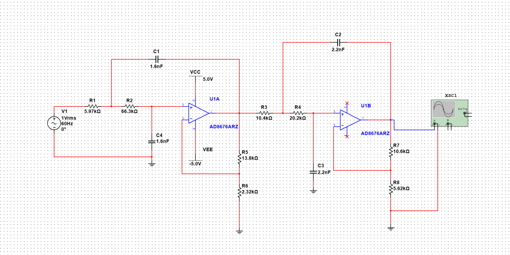
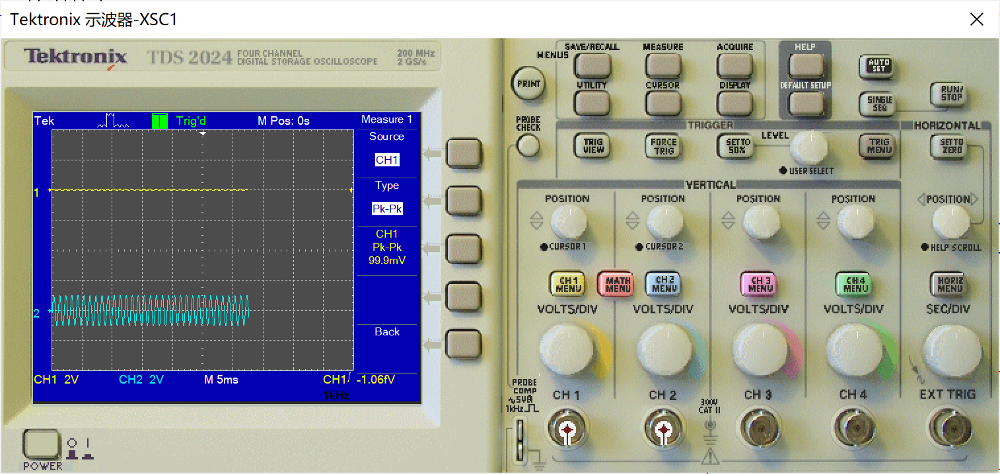
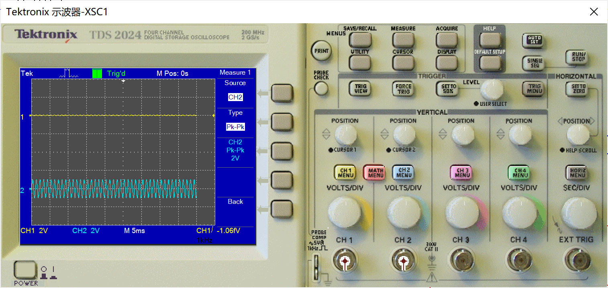
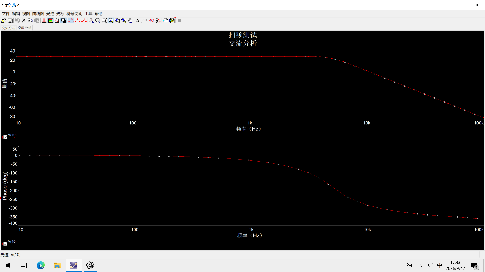
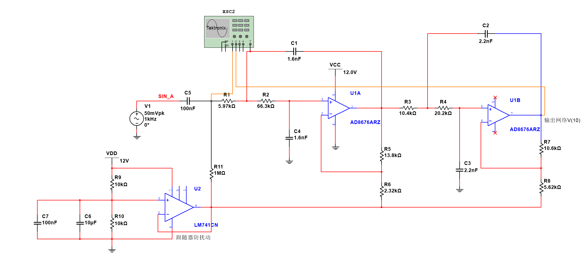
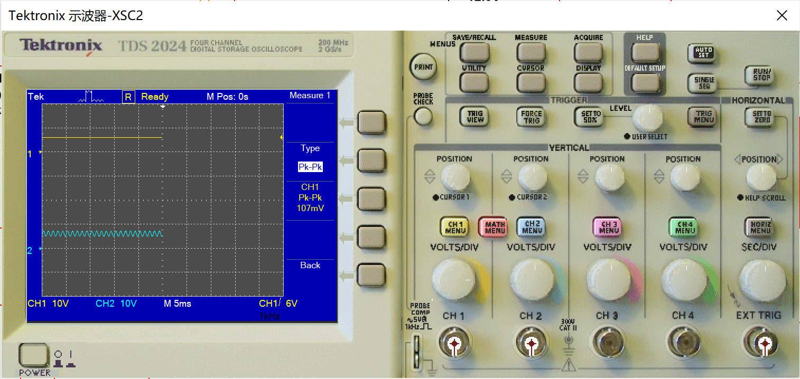

# 滤波放大电路供电修改

将滤波放大电路的芯片供电由原来的±5V改为+12V和0V。

## 1. 修改前的电路

按原电路搭建两级滤波放大部分，使用±5V供电。

## 2. 原电路的放大测试

在约1kHz的测试信号下，示波器测得输入峰峰值为99.9mV，输出峰峰值为2.00V。得到放大倍数约为20.0倍。

输入峰峰值：

输出峰峰值：

## 3. 原电路的扫频测试

对原电路进行了扫频。曲线在低频部分比较平坦，频率升高后幅度逐渐下降，符合低通滤波的特点。

## 4. 修改思路

1. 将滤波放大芯片的供电改为+12V和0V，原来的滤波电阻、电容及反馈电阻数值先保持不变。
2. 参考老师给的图，在滤波输入处增加约6V偏置。
3. 用两个10kΩ电阻分压产生约6V，再通过运放跟随器输出，作为参考电压。分压中点增加100nF和10µF电容，帮助减少参考电压的波动。
4. 输入先经过100nF耦合电容隔离直流，在电容右侧通过1MΩ电阻接到6V参考。
5. 将两级反馈电阻的下端（R6、R8）从地改接6V参考，使放大也以6V为中心。

## 5. 修改后的电路

目前修改后的电路如下，测试信号接在输入耦合电容左侧。

## 6. 修改后的放大测试

在约1kHz的测试下，示波器测得输入峰峰值为107mV，输出峰峰值为2.15V，放大倍数约为：

2.15V ÷ 0.107V ≈ 20.1倍。

这个结果与原电路约20倍的放大效果基本一致。

输入峰峰值：

输出峰峰值：

## 7. 修改后的扫频测试

修改后又进行了扫频，曲线仍然表现为低频段通过、较高频率衰减。加入输入耦合电容后，在很低的频率处也出现了衰减，后续需要结合实际信号频率确认是否会影响测量。
